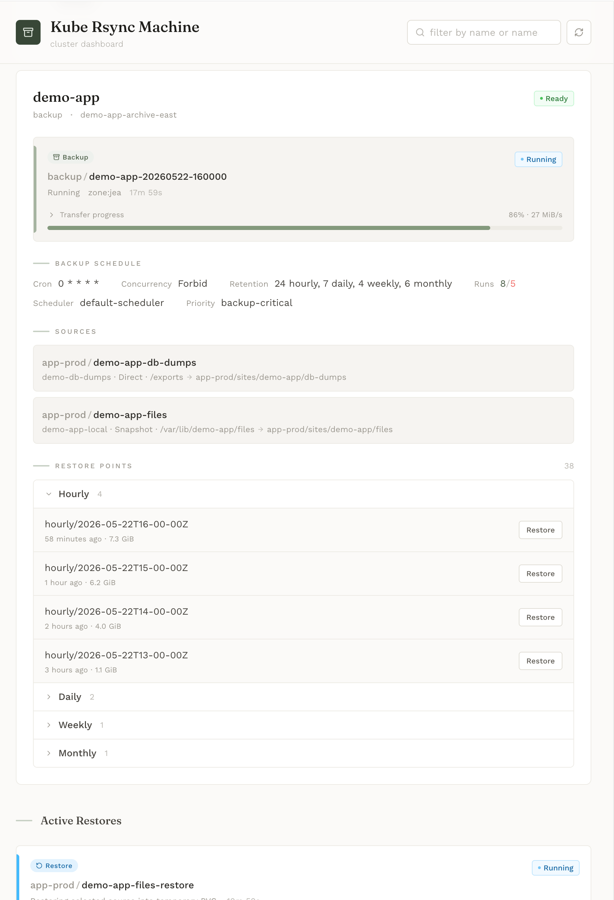

# kube-rsync-machine

`kube-rsync-machine` is a Kubernetes operator for backing up and restoring
PersistentVolumeClaims with rsync, hardlinked snapshots, and Kubernetes-native
custom resources.

It is designed for cluster administrators who want PVC backup workflows that
fit naturally into Kubernetes: declarative sources and targets, scheduled runs,
durable status, RBAC-friendly namespaces, mTLS-protected transfer jobs, and a
small frontend for operational visibility.

Because transfers use rsync, each backup only sends file changes relative to
the previous restore point instead of copying the full PVC every time. The
target still presents each successful run as a complete restore tree.



## Why It Exists

Many Kubernetes workloads keep important state in PVCs, but not every cluster
or workload needs a full object-storage backup stack. `kube-rsync-machine`
targets the practical middle ground: copy filesystem data from source PVCs into
a target PVC, retain point-in-time restore trees, and let operators restore a
single protected source when needed.

The operator is useful when you want:

- Declarative PVC backup definitions managed with GitOps.
- Space-efficient restore points on a normal Kubernetes PVC.
- Hourly, daily, weekly, and monthly retention tiers.
- Manual and scheduled backup runs represented as Kubernetes resources.
- Restore jobs that copy a selected snapshot into an existing or replacement
  PVC.
- Status, progress, and restore-point discovery through Kubernetes APIs and a
  frontend dashboard.

This project is still early backup software. Test backup and restore workflows
with disposable data before relying on it for important workloads.

## Features

- **Kubernetes-native API**: `BackupSource`, `RsyncMachine`, `BackupJob`, and
  `RestoreJob` CRDs describe sources, targets, runs, schedules, and restores.
- **PVC-to-PVC backups**: source PVC data is copied to a target PVC using
  generated Kubernetes Jobs.
- **Incremental transfers**: rsync sends only changed file content after the
  first backup, reducing network and runtime cost for repeat backups.
- **Hardlinked snapshots**: repeated restore points share unchanged files to
  reduce target PVC usage.
- **Retention tiers**: keep independent hourly, daily, weekly, and monthly
  restore points.
- **Current-state mirrors**: use the `Mirror` strategy for single-shot style
  rsync into the target PVC root without restore point directories.
- **Target space recovery**: when a target PVC runs short on space, the target
  job can prune older eligible restore points and retry the transfer.
- **Stable `latest` restore point**: restore the most recent successful backup
  without calculating snapshot names.
- **Scheduled and manual runs**: use `spec.schedule` for recurring backups or
  create a `BackupJob` directly for an on-demand run.
- **Optional CSI snapshot capture**: use `VolumeSnapshot` when available for a
  stable source view, with direct rsync fallback when configured as `Auto`.
- **mTLS data plane**: generated source, target, and restore jobs use
  short-lived certificates for run-scoped transfers.
- **Cross-namespace workflows**: source, target, and restore PVCs can live in
  different namespaces while generated resources remain in the namespace where
  their PVC is mounted.
- **Target exclusivity**: the controller prevents concurrent backup and restore
  activity from racing on the same target snapshot tree.
- **Live operator UI**: inspect machines, runs, sources, restore points, and
  progress from the included frontend.
- **Prometheus metrics and Kubernetes status**: durable summaries are written to
  CR status, with metrics for operator monitoring.

## Use Cases

- Back up application PVCs before upgrades, migrations, or risky maintenance.
- Keep short-term operational restore points for stateful workloads.
- Restore a single application's files into a replacement PVC for inspection.
- Protect many source PVCs into a shared backup PVC with namespace-isolated
  paths.
- Back up PVCs across availability zones in stretched clusters so restore data
  is already present in a different failure domain for disaster recovery.
- Run GitOps-managed backup schedules per application, namespace, or storage
  tier.
- Provide a lightweight rsync-based backup option for homelab, edge, staging,
  and small production clusters.
- Test restore procedures regularly with disposable destination PVCs.

## How It Works

Admins define one or more `BackupSource` resources for the PVCs to protect and
one `RsyncMachine` resource for the target PVC and retention policy. A manual or
scheduled `BackupJob` starts a target-side receiver job and one source-side
sender job per source. The target stages data under `.partial/<run-id>`, then
promotes a successful run into an immutable hourly snapshot and updates
retention tiers.

Restore uses a `RestoreJob`. The restore references one `BackupSource`, selects
a snapshot such as `latest` or `hourly/<timestamp>`, and writes the selected
source tree into the destination PVC.

For full operational details, see:

- [User Guide](docs/user-guide.md)
- [CRD Reference](docs/crd-reference.md)
- [Operator Design](docs/operator-design.md)

## Quick Start

Install the CRDs, RBAC, manager deployment, and service:

```sh
kubectl --context <cluster-context> apply -k config/default
```

Check the manager rollout:

```sh
kubectl --context <cluster-context> -n kube-rsync-machine-operator rollout status \
  deployment/kube-rsync-machine-controller-manager
```

Create a target machine:

```yaml
apiVersion: krm.chirino.github.io/v1alpha1
kind: RsyncMachine
metadata:
  name: app-hourly
  namespace: kube-rsync-machine
spec:
  pvcName: app-backups
  schedule: "0 * * * *"
  retention:
    hourly: 24
    daily: 7
    weekly: 4
    monthly: 6
```

Create a source:

```yaml
apiVersion: krm.chirino.github.io/v1alpha1
kind: BackupSource
metadata:
  name: app-data
  namespace: default
spec:
  machineRef:
    namespace: kube-rsync-machine
    name: app-hourly
  pvc: app-data
  destinationPath: app/data
```

Run an on-demand backup:

```yaml
apiVersion: krm.chirino.github.io/v1alpha1
kind: BackupJob
metadata:
  name: app-hourly-manual
  namespace: kube-rsync-machine
spec:
  machineRef:
    name: app-hourly
```

Watch progress:

```sh
kubectl --context <cluster-context> -n kube-rsync-machine get backupjobs
kubectl --context <cluster-context> -n kube-rsync-machine describe backupjob app-hourly-manual
```

List restore points:

```sh
kubectl --context <cluster-context> -n kube-rsync-machine get rsyncmachine app-hourly \
  -o jsonpath='{range .status.restorePoints[*]}{.snapshot}{"\t"}{.resolvesTo}{"\n"}{end}'
```

## Admin Notes

- The target PVC must be large enough for retained snapshots and filesystem
  metadata. Emergency pruning can recover space by deleting older eligible
  restore points, but it is not a substitute for capacity planning.
- Rsync preserves numeric UID/GID values with `--numeric-ids`; pods do not need
  a shared user database.
- `VolumeSnapshot` support is optional. Direct rsync works on clusters without
  CSI snapshot CRDs.
- Generated jobs mount PVCs in the same namespace as the PVC they use.
- Restoring into a separate PVC first is recommended for validation before
  replacing application data.

## Development

Run unit tests:

```sh
task test
```

Run kind integration tests:

```sh
task test-integration
```

Run the frontend locally with mock data:

```sh
task dev:frontend
```
